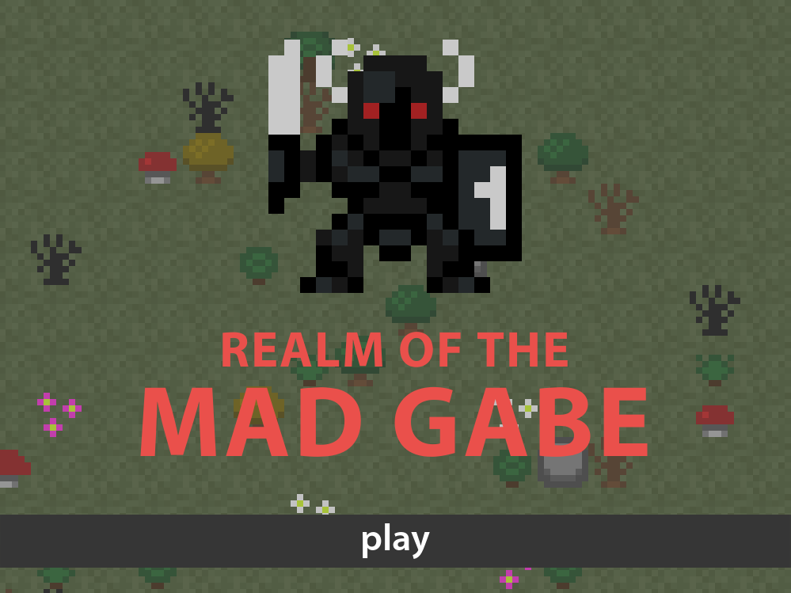

**Reverse-Engineering of Realm of the Mad God, made with the goal of recreating the core mechanics of the game without the use of an external game engine or game engine library.**

**[Download and play here](https://drive.google.com/drive/folders/1eDCwejVu6gYtlVhL0JvSepFS0KubVKLO?usp=sharing)**

**Installation Instructions:**
1. Select appropriate OS
2. Download ENTIRE contents of a given OS folder
3. Extract/Unzip downloaded contents in a new folder of your choice, and run rotmg.exe

**Controls:**
  - Keyboard:
      - *wasd* - Movement
      - *space* - Use Ability
      - *f* - Escape to nexus
      - *1-8* - Use inventory item
      - *esc* - Main menu
      - *m* - Toggle music
  
  - Mouse:
      - *Click on world* - Shoot
      - *Click and drag item* - Move item
      - *Shift click item* - Use item
      - *Mouse hover item* - View item description
      - *Mouse scroll* - Mini map zoom adjustment
        

