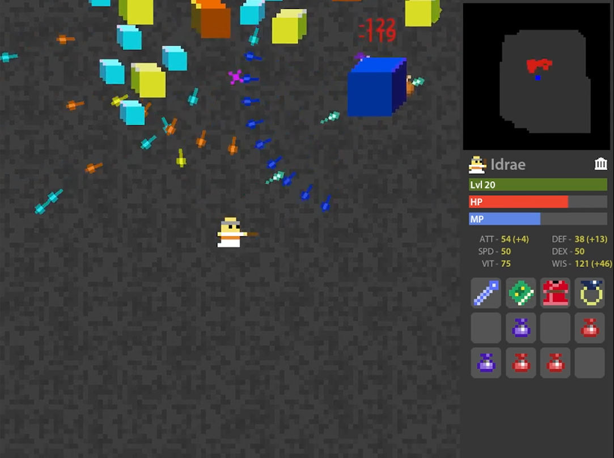
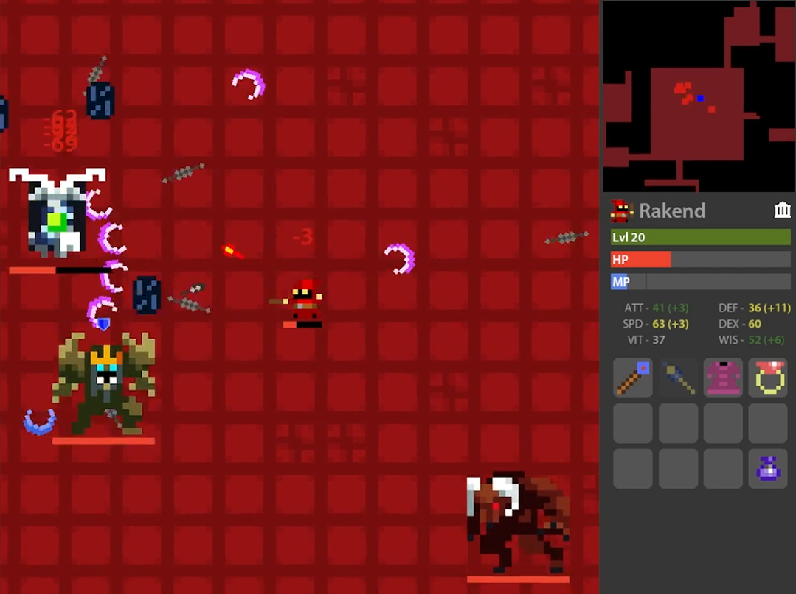

**Reverse-Engineering of [Realm of the Mad God](https://en.wikipedia.org/wiki/Realm_of_the_Mad_God) made with the goal of recreating the core mechanics of the game without the assistance of an external game engine or game engine library** 

**Links**
 - **[Download To Play Here](https://drive.google.com/drive/folders/1eDCwejVu6gYtlVhL0JvSepFS0KubVKLO?usp=sharing)**

 - **[Release 2.0 Trailer](https://www.youtube.com/watch?v=aP7Ju_zDels)**

 - **[Rare Item Drop Guide](https://imgur.com/a/realm-of-mad-gabe-rdt-guide-dW4zCsx)**

**Gameplay and Objective**
  - Realm of the Mad Gabe is a 2.5D bullet hell with RPG/rogue-like elements including permanent death, produecurally gernerated dungeons, and different playable classes with unique abilities. Your main objectives are to conquer monsters and dungeons which increase in difficulty and to upgrade the stats and equipment of your characters

**Preview Gallery: (Gif is 10 FPS; game FPS shown in top-left)**

**Controls:**
  - Keyboard:
      - *wasd* - Movement
      - *space* - Use Ability
      - *f* or *r* - Escape to nexus
      - *1-8* - Use inventory item
      - *esc* - Main menu
      - *m* - Toggle music
      - *t* - Toggle auto-fire
      - *h* - Toggle boss & player health bars
  
  - Mouse:
      - *Click on world* - Shoot
      - *Click and drag item* - Move item
      - *Shift click item* - Use item
      - *Mouse hover item* - View item description
      - *Mouse scroll* - Mini map zoom adjustment

**Tips:**
  - Your stats will increase as you level-up from gaining xp by slaying monsters. 20 is the max level for your character, but you will still be able to increase your stats via stat-increase potions
  - Your characters and vault will save between sessions; use the vault to move items between characters
  - Scroll out entirely to view boss location(s); they are always visible if they're alive
  - If you're low HP in a dungeon, save your character by escaping to nexus
  - You can drop items by dragging them into the world from your inventory

**Good luck! Thanks for playing**
