# Realm of the Mad Gabe

**Realm of the Mad Gabe** is a C++ video game built from scratch without a game engine. It uses [SDL2](https://www.libsdl.org/) for hardware interactions (rendering, input, audio, etc.), with [GDB](https://sourceware.org/gdb/) and [Valgrind](https://valgrind.org/) used for debugging and memory analysis during development. It is a clone of [Realm of the Mad God](https://en.wikipedia.org/wiki/Realm_of_the_Mad_God) utilizing art from [Oryx Design Lab](https://www.oryxdesignlab.com/). A video demonstration is available [here](https://www.youtube.com/watch?v=aP7Ju_zDels).

|  | 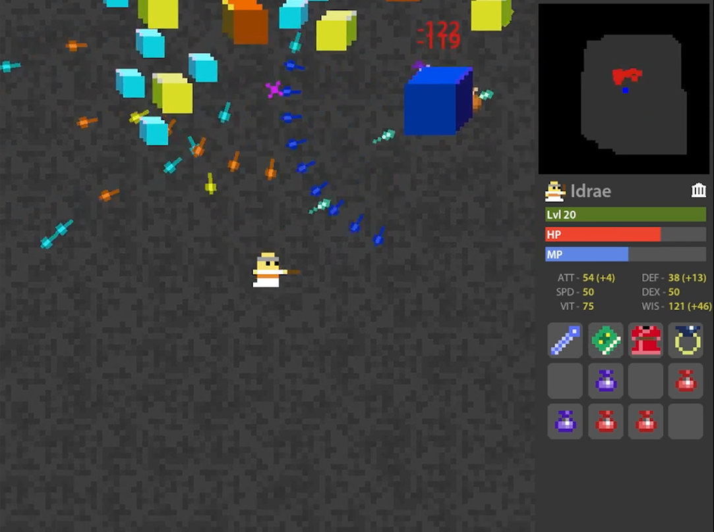 |
|-------------------------------------|-------------------------------------|
| 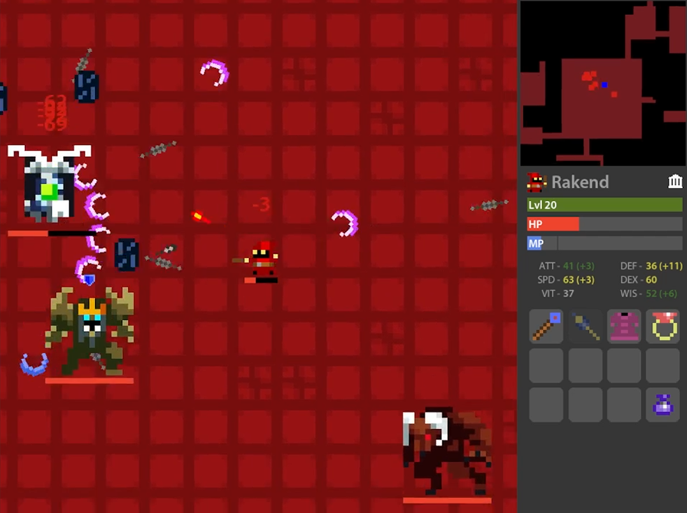 | 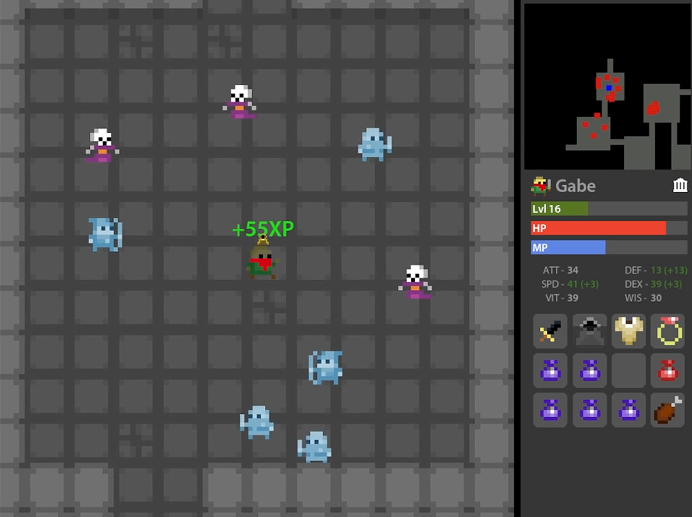 |

---

## Entity Component System (ECS)

The core of this project is an implementation of the [Entity Component System](https://en.wikipedia.org/wiki/Entity_component_system) architectural pattern which allows for high frames-per-second (FPS) gameplay through CPU cache friendliness, enabled by high spatial and temporal locality of game data during each frame update.

- **Entities** → IDs only  
- **Components** → Pure data  
- **Systems** → Update components  

---

## Entities and Components

Entities contain no data. Instead, their state is stored in separate components.

| Entities (ID only) | Components (data only) |
|------------------------|----------------------------|
| 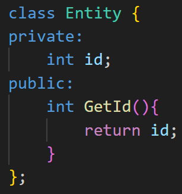 | 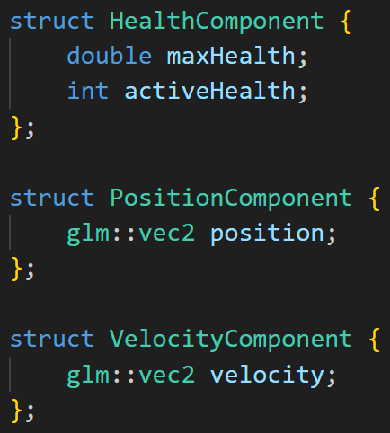 |

---

## Components Storage

Entities do not store their own components. Instead, they are stored in pools which are arrays of components.

### Component Implementation

Components use static per-type ID generation via a templated base class.

  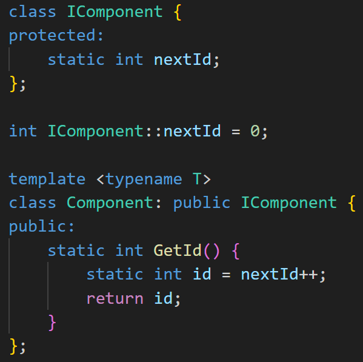

  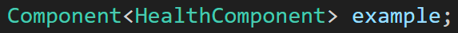

### Pool Implementation

Pools are an array created for each type of component.

  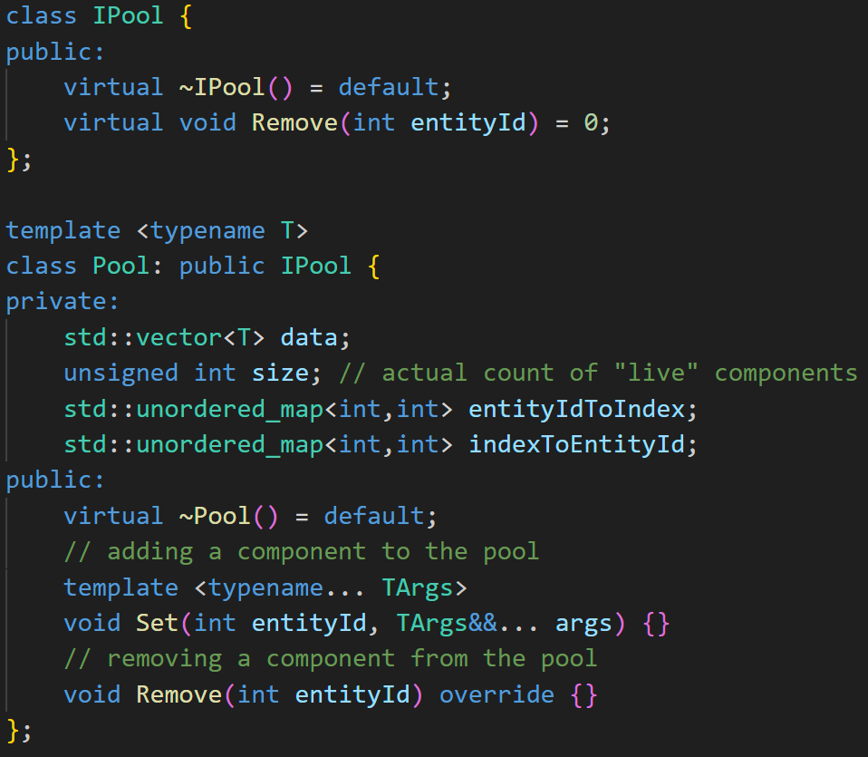

### Pool Storage

All pools are stored in an array, allowing a component ID to be used to access its corresponding pool, where each entry stores the component for a specific entity.

  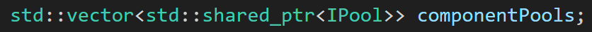

  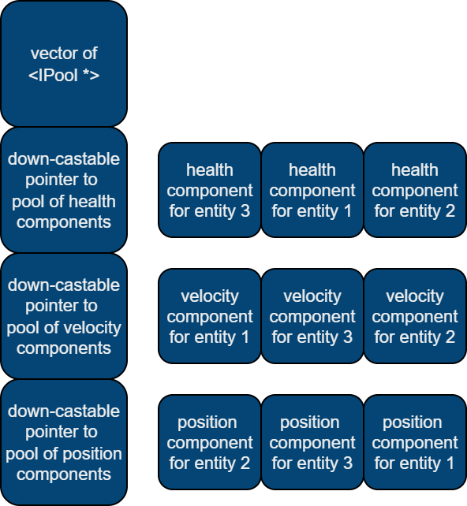

---

## Signatures

The total set of components that an entity has is tracked tracked using a bitset indexed by component ID.

  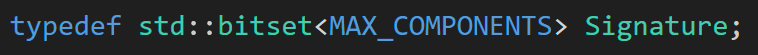

  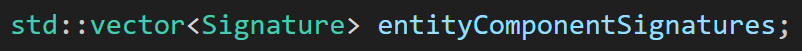

---

## Example Entities With Component Signatures

| Floor | Tree | Projectile |
|------|------|------------|
| 
 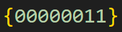 A floor has a sprite and position component.
 | 
 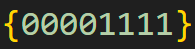 A tree has a sprite, position, hitbox, and rigidbody component.
 | 
 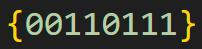 A projectile has a sprite, position, hitbox, velocity, etc.
 |

---

## Putting it all together: Adding a component to an entity

To add a component to an entity:

- The component ID is used to index the array of pools to get the pool for that component type
- The component is inserted into the pool 
- The pool associates the stored component position with the entity’s ID
- The signature of the entity is updated to indicate that it has this component
- Relevant systems are updated to track this entity if it matches their requirements (see next section!)

  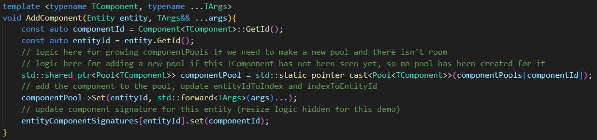

---

## Systems

Systems perform updates on entities by modifying their components and are specialized to track only those entities whose component signatures match their own.

### System base class

  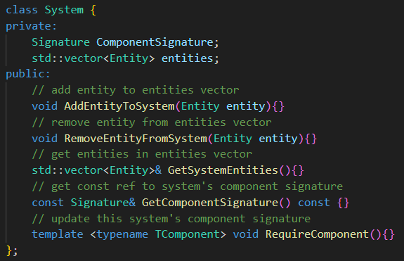

### Example: Render System

The render system tracks all entities with a sprite and position.

  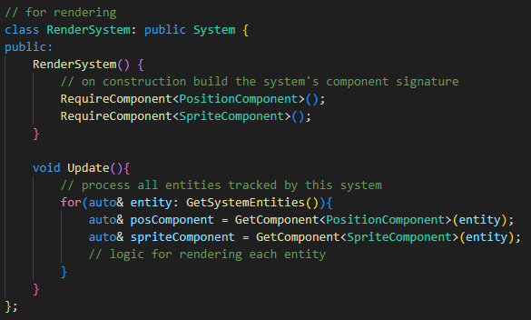

### Signature match example

  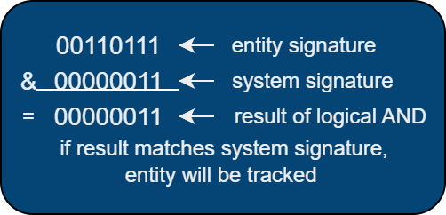

---

## Performance: Cache Efficiency

Performance comes primarily from **cache efficiency**.

- Components are stored contiguously
- Systems iterate linearly over data
- Cache lines (typically 64 bytes) load multiple components at once
- This leads to high cache hit rates

---

## Object-Oriented Design (OOP) vs Data-Oriented Design (DoD)

DoD keeps components small and organized around how data is accessed during system updates to improve cache efficiency. Ideally, when a component is fetched, all of its fields will be used to improve cache efficiency. Here’s a comparison of OOP vs DoD for a player-statistics component:

| Object-Oriented Design | Data-Oriented Design |
|------------------------|----------------------|
| 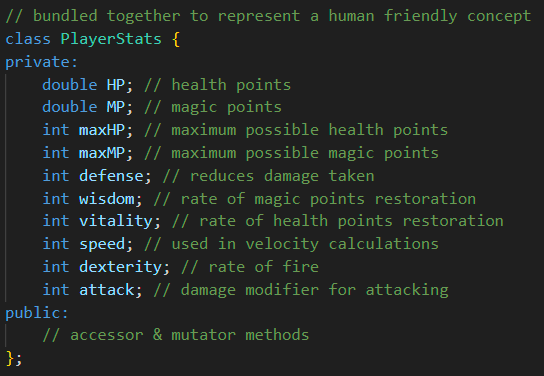 | 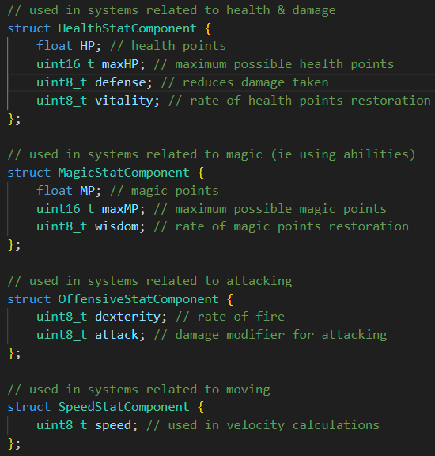 |

As you can see, the DoD version breaks up the component into smaller, focused components that will result in higher cache efficiency during related system updates.

---

## Dense Pool Storage

Pools remain dense by filling memory gaps when entities are removed, reducing cache misses:

  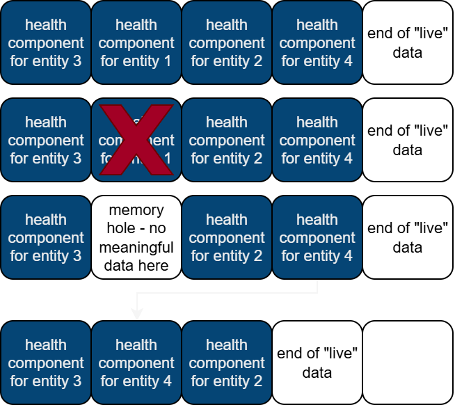

---

## AoS vs SoA

This implementation uses an array-of-structures (AoS) layout where each component is stored as a single object. This is useful when systems access all fields. An alternative is struct-of-arrays (SoA), where fields are stored separately for better auto-vectorization. Below is a comparison for a component with three fields.

### Array of Structures (AoS)
| Code Representation | Memory Representation |
|---------------------|----------------------|
| 
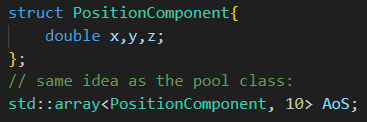
 | 
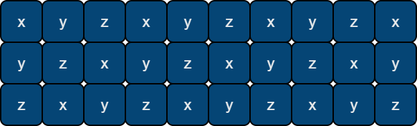
 |

### Structure of Arrays (SoA)

| Code Representation | Memory Representation |
|---------------------|----------------------|
| 
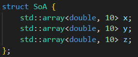
 | 
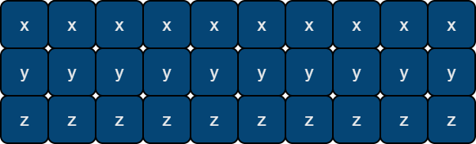
 |
---

## Manager Class

Essential operations such as managing entities, pools, and systems are handled by an ECS “Manager” class which is omitted from this writeup to keep the focus on the core underlying mechanisms.

---

## Download and Play

Executables for Windows and Linux are available [here](https://drive.google.com/drive/u/0/folders/1eDCwejVu6gYtlVhL0JvSepFS0KubVKLO). 
