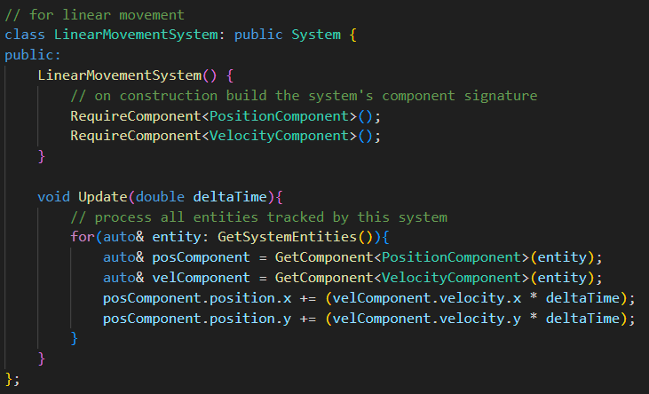
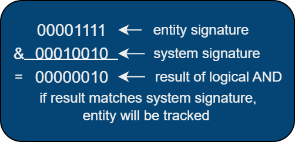

# Realm of the Mad Gabe

**Realm of the Mad Gabe** is a C++ video game made without the assistance of a game engine or game engine library. It was made using [GDB](https://sourceware.org/gdb/), [Valgrind](https://valgrind.org/), and [SDL2](https://www.libsdl.org/). It is a clone of [Realm of the Mad God](https://en.wikipedia.org/wiki/Realm_of_the_Mad_God), utilizing art from [Oryx Design Lab](https://www.oryxdesignlab.com/).

---

## Demo (Youtube Video)

---

## Entity Component System (ECS)

The core of this project is an implementation of the [Entity Component System](https://en.wikipedia.org/wiki/Entity_component_system) architectural pattern.

- **Entities** → IDs only  
- **Components** → Pure data  
- **Systems** → Update components  

This design is CPU cache-friendly, resulting in high performance and high frame rates.

---

## Entities and Components

Entities contain no data. Instead, their data lives in separate components.

### Entities (ID only)

### Components (data only)

---

## Component Storage (Pools)

Entities do not store their own components. Instead, they are stored in pools which are arrays of components.

### Pool Implementation

### Components Full Implementation

Components use static per-type ID generation via a templated base class.

### Pool Storage

All pools are stored in an array, allowing a component ID to be used to access its corresponding pool, where each entry stores the component for a specific entity.

---

## Signatures

The total set of components that an entity has is tracked using a bitsets which is indexable by component ID.

---

## Example Entities With Component Signatures

### Floor

A floor has a sprite and position component.

### Tree

A tree has a sprite, position, hitbox, and rigidbody component.

### Projectile

A projectile has a sprite, position, hitbox, velocity, etc. 

---

## Putting it all together: Adding a component to an entity

To add a component to an entity:

- The component ID is used to index the array of pools to get the pool for that component type
- The component is inserted into the pool 
- The pool associates the stored component position with the entity’s ID
- The signature of the entity is updated to indicate that it has this component
- Relevant systems are updated to track this entity if it matches their requirements (see next section!)

---

## Systems

Systems perform updates on entities by modifying their components and are specialized to track only those entities whose component signatures match their own.

### System base class

### Example: Render System (tracks all entities with a sprite and position)

### Example: Movement System (tracks all entities with position and velocity)

### Signature match example

### Signature mismatch example

---

## Performance: Cache Efficiency

Performance comes primarily from **cache efficiency**.

- Components are stored contiguously
- Systems iterate linearly over data
- Cache lines (typically 64 bytes) load multiple components at once
- This leads to high cache hit rates

---

## Object-Oriented Design vs Data-Oriented Design

In DoD, components are kept small and structured around access patterns (fields are added to components with system usage in mind) to minimize cache misses. Here is how a player-statistics component would be designed in both OOP and DoD:

### Object-Oriented Design (counter-example: worse for cache hits)

### Data-Oriented Design (what is used: better for cache hits)

---

## Dense Pool Storage

Pools remain dense by filling memory gaps when entities are removed, reducing cache misses:

---

## AoS vs SoA

This ECS implementation uses an array-of-structures (AoS) layout, where each component is stored as a single object. This works well when systems need all fields of a component. Some ECS designs use a struct-of-arrays (SoA) layout instead, where each field is stored in a separate array, which is better for auto-vectorizaton. Below is a visualization of both layouts for a component with three fields:

### Array of Structures (AoS; what was used)

### Structure of Arrays (SoA; alternative design)

---

## Manager Class

Essential operations such as the management of entities, pools, and systems are the responsibility of an ECS "Manager" class which I've omitted from this writeup to keep explanations concise and centered on the essential underlying mechanisms.

---

## Download and Play

Executables for Windows and Linux are available [here](https://drive.google.com/drive/u/0/folders/1eDCwejVu6gYtlVhL0JvSepFS0KubVKLO). 

## Gallery

Gif is 10 FPS; game FPS shown in top-left

<table>
  <tr>
    <td></td>
    <td></td>
  </tr>
  <tr>
    <td></td>
    <td></td>
  </tr>
</table>