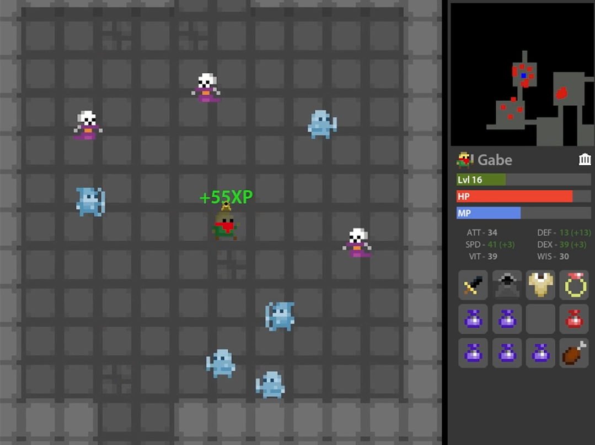

**Reverse-Engineering of [Realm of the Mad God](https://en.wikipedia.org/wiki/Realm_of_the_Mad_God) made with the goal of recreating the core mechanics of the game without the use of an external game engine or game engine library.**

**[Download and play here](https://drive.google.com/drive/folders/1eDCwejVu6gYtlVhL0JvSepFS0KubVKLO?usp=sharing)** (see instructions.txt)

**Controls:**
  - Keyboard:
      - *wasd* - Movement
      - *space* - Use Ability
      - *f* or *r* - Escape to nexus
      - *1-8* - Use inventory item
      - *esc* - Main menu
      - *m* - Toggle music
      - *t* - Toggle auto-fire
      - *h* - Toggle boss & player health bars
  
  - Mouse:
      - *Click on world* - Shoot
      - *Click and drag item* - Move item
      - *Shift click item* - Use item
      - *Mouse hover item* - View item description
      - *Mouse scroll* - Mini map zoom adjustment

**Tips:**
  - Your stats will increase as you level-up from gaining xp by slaying monsters
  - Your characters and vault will save between sessions; use the vault to move items between characters
  - Scroll out entirely to view boss location in a dungeon
  - If you're low HP in a dungeon, press *f* to save your character by escaping to nexus
  - You can drop items by dragging them into the world from your inventory

**Preview Gallery:**

**Good luck! Thanks for playing**
